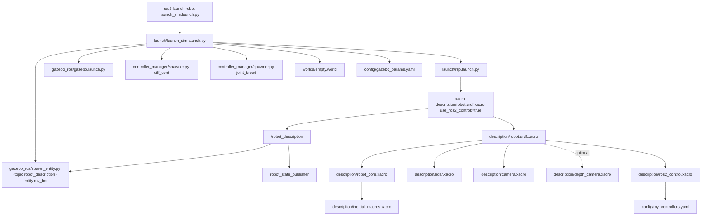
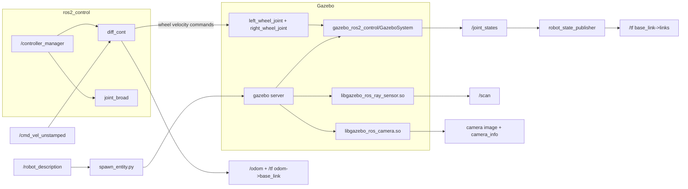
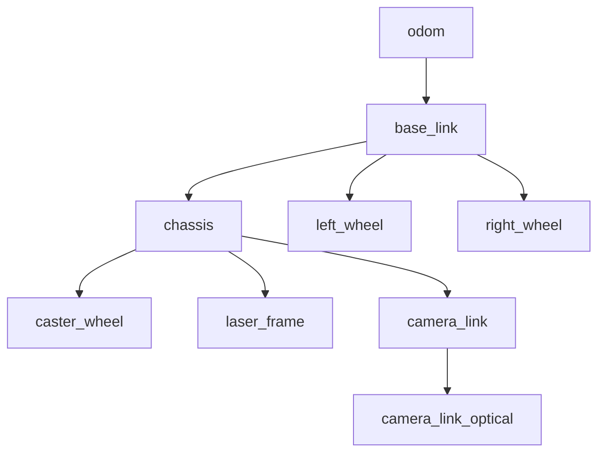

# robot: ROS 2 Differential Drive Simulation Stack

This package contains a complete simulation stack for a differential drive robot in Gazebo Classic with:

- Robot model authored in Xacro/URDF
- `ros2_control` wheel actuation (`DiffDriveController`)
- Simulated lidar + camera
- Prebuilt Gazebo world with walls and obstacles
- RViz configs for robot-only and odom-based views

It is designed as a single ROS 2 package named `robot`.

## What This Repo Runs

When you launch simulation, this package:

1. Builds `robot_description` from Xacro.
2. Starts `robot_state_publisher` to publish TF for robot links.
3. Starts Gazebo with a custom world and Gazebo ROS parameters.
4. Spawns the robot entity into Gazebo from `/robot_description`.
5. Starts controller manager spawners:
   - `diff_cont` (`diff_drive_controller/DiffDriveController`)
   - `joint_broad` (`joint_state_broadcaster/JointStateBroadcaster`)
6. Publishes sensor data (`/scan`, camera topics) and odometry (`/odom`, `/tf`).

## Architecture (Mermaid)

### 1) Launch + File Composition



### 2) Runtime Data Flow



### 3) TF Tree



## Repository Layout

| Path | Role |
|---|---|
| `launch/launch_sim.launch.py` | Main simulation launch (Gazebo + spawn + controllers) |
| `launch/rsp.launch.py` | Robot state publisher launch + Xacro expansion |
| `description/robot.urdf.xacro` | Top-level robot model composition |
| `description/robot_core.xacro` | Base/chassis/wheels/caster links and joints |
| `description/ros2_control.xacro` | `ros2_control` interfaces + Gazebo system plugin |
| `description/lidar.xacro` | Lidar sensor and Gazebo ROS lidar plugin |
| `description/camera.xacro` | RGB camera sensor and Gazebo ROS camera plugin |
| `description/depth_camera.xacro` | Alternative depth camera model (not enabled by default) |
| `config/my_controllers.yaml` | Controller manager, diff drive, and broadcaster params |
| `config/gazebo_params.yaml` | Gazebo ROS parameter file passed via launch |
| `config/robot.rviz` | RViz config (fixed frame `base_link`) |
| `config/robot_odom.rviz` | RViz config (fixed frame `odom`) |
| `worlds/empty.world` | Main world loaded by launch (includes room + props) |
| `worlds/room_model/model.sdf` | Standalone room model definition |

## Prerequisites

- Ubuntu 20.04
- ROS 2 Foxy
- Gazebo Classic 11 (via ROS integration packages)
- `colcon`, `rosdep`, `xacro`

If ROS 2 is not installed yet, install `ros-foxy-desktop` first.

## Install

### 1) Clone into a workspace

```bash
mkdir -p ~/robot_ws/src
cd ~/robot_ws/src
git clone <your-repo-url> robot
```

### 2) Install dependencies

Use ROS environment for your shell:

```bash
# Bash
source /opt/ros/foxy/setup.bash

# Zsh
# source /opt/ros/foxy/setup.zsh
```

Install what `package.xml` declares:

```bash
cd ~/robot_ws
rosdep update
rosdep install --from-paths src --ignore-src -r -y
```

This repository currently uses runtime ROS/Gazebo plugins that are not fully declared in `package.xml` yet, so install these once:

```bash
sudo apt update
sudo apt install -y \
  ros-foxy-gazebo-ros-pkgs \
  ros-foxy-gazebo-ros2-control \
  ros-foxy-ros2-control \
  ros-foxy-ros2-controllers \
  ros-foxy-xacro \
  ros-foxy-rviz2
```

### 3) Build

```bash
cd ~/robot_ws
colcon build --symlink-install
```

### 4) Source overlay

```bash
# Bash
source ~/robot_ws/install/setup.bash

# Zsh
# source ~/robot_ws/install/setup.zsh
```

## Run

### Full simulation

```bash
ros2 launch robot launch_sim.launch.py
```

### Open RViz (optional)

```bash
rviz2 -d $(ros2 pkg prefix robot)/share/robot/config/robot_odom.rviz
```

### Send motion commands

This controller expects unstamped velocity commands (`use_stamped_vel: false`):

```bash
# Forward
ros2 topic pub /cmd_vel_unstamped geometry_msgs/msg/Twist \
  "{linear: {x: 0.25, y: 0.0, z: 0.0}, angular: {x: 0.0, y: 0.0, z: 0.0}}" -r 10

# Rotate
ros2 topic pub /cmd_vel_unstamped geometry_msgs/msg/Twist \
  "{linear: {x: 0.0, y: 0.0, z: 0.0}, angular: {x: 0.0, y: 0.0, z: 0.6}}" -r 10
```

### Check expected interfaces

```bash
ros2 topic list
ros2 control list_controllers
ros2 control list_hardware_interfaces
```

Expected core outputs include:

- `/tf`, `/tf_static`
- `/odom`
- `/joint_states`
- `/scan`
- camera image/info topics

## Dependency Management Strategy

For reliable installs across machines, manage dependencies in this order:

1. Keep `package.xml` as the source of truth for ROS package dependencies (`<depend>...</depend>`).
2. Run `rosdep install --from-paths src --ignore-src -r -y` after any dependency change.
3. Keep plugin-specific runtime deps aligned with what your Xacro/launch loads:
   - `gazebo_ros2_control/GazeboSystem`
   - `diff_drive_controller`
   - `joint_state_broadcaster`
   - Gazebo ROS camera/ray plugins
4. Rebuild with `colcon build --symlink-install` after updates.

When you add a new sensor/plugin/controller:

1. Add/modify Xacro and config YAML.
2. Add dependency to `package.xml`.
3. Run `rosdep install ...`.
4. Rebuild and relaunch.

## Configuration You Will Usually Edit

- `launch/launch_sim.launch.py`
  - Change the world file path.
  - Change launch arguments passed to `rsp.launch.py`.
- `config/my_controllers.yaml`
  - Tuning: wheel separation/radius, publish rates, command mode.
- `description/robot_core.xacro`
  - Robot geometry, link positions, inertias.
- `description/lidar.xacro` and `description/camera.xacro`
  - Sensor rates, FOV/range, plugin topic remaps.
- `worlds/empty.world`
  - Simulation environment and obstacle set.

## Troubleshooting

- Controllers fail to spawn:
  - Check `ros2 control list_controllers`
  - Verify `config/my_controllers.yaml` path and plugin availability.
- Robot does not move:
  - Publish to `/cmd_vel_unstamped` (not `/cmd_vel` in current config).
  - Confirm `diff_cont` state is `active`.
- Missing `/scan` or camera topics:
  - Verify sensor plugins are present in Xacro includes.
  - Confirm Gazebo ROS plugin packages are installed.
- Missing TF or weird RViz frame behavior:
  - Use `robot_odom.rviz` when inspecting global motion (`odom` frame).
  - Use `robot.rviz` when focusing on robot-local model (`base_link` frame).

## Notes

- Package metadata (`package.xml`) is still template-level and should be completed for production/distribution.
- The default launch path is optimized for simulation (`use_sim_time=true`, `use_ros2_control=true`).
